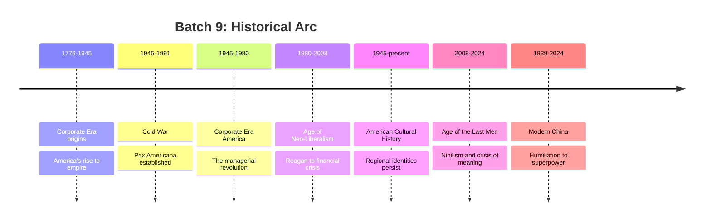

# MOC: Cold War & Modern America

> **Batch 9 of History102** — 7 videos covering the Cold War, American global hegemony, the corporate transformation of America, the neoliberal revolution, American cultural history, the philosophical crisis of modernity, and the rise of Modern China.

## The Videos

| Note | Video ID | Duration | Core Topic |
|------|----------|----------|------------|
| [[Cold War]] | `xBmX_7i3s0w` | 2h 41min | Origins, structure, and geopolitics of the Cold War (1945-1991) |
| [[Pax Americana]] | `j9PJPK_jeZg` | 2h 26min | The American-led global order as a "post-modern anti-empire" |
| [[Corporate Era America]] | `OxINJcvAoB4` | 2h 29min | The managerial revolution and the transformation of American society |
| [[Age of Neo-Liberalism]] | `CLVkde6fof0` | 2h+ | The post-Cold War neoliberal order: rise, triumph, and unraveling |
| [[American Cultural History]] | `q49jYhAOkCE` | 2h+ | America's regional subcultures from Albion's Seed to today |
| [[Age of the Last Men]] | `R3TFZpJari0` | 2h 17min | Nietzsche's prophecy: bureaucracy, nihilism, and spiritual stagnation |
| [[Modern China]] | `SuUrDpy85wM` | 2h+ | China's journey from imperial decline to superpower resurgence |

## Thematic Connections

### The American Empire Paradox
A thread running through multiple episodes: America is an empire that denies being one. The [[Pax Americana]] episode frames this as the "anti-empire" problem — the US projects unprecedented global power while its domestic population is told it doesn't have an empire. This creates the schizophrenia in foreign policy ([[Cold War]]) and domestic governance ([[Corporate Era America]]) that Lynch argues is both America's weakness and its strength.

### The Managerial Class and the "Terrarium"
[[Corporate Era America]] introduces Sam Francis's thesis of the managerial revolution: the bureaucratic class's rise to power at the expense of the old WASP industrial elite. This theme recurs in [[Age of the Last Men]], where the bureaucratic "terrarium" produces conformity, nihilism, and social decay. The managerial elite, having won its war against the old order, now presides over a society stripped of meaning.

### The Neoliberal Project
[[Age of Neo-Liberalism]] traces the ideological framework that governed the post-Cold War world — the attempt to reconcile Anglo-Saxon liberty with French-style state protection. This neoliberal consensus is shown as the connective tissue between the [[Cold War]]'s end and the rise of the problems dissected in [[Age of the Last Men]] and [[Corporate Era America]].

### The Geography of Culture
[[American Cultural History]] provides the regional substrate for the political and economic transformations examined elsewhere. The red-state/blue-state divide analyzed in [[Corporate Era America]] is shown to have deep roots in the four British folk migrations (Albion's Seed thesis). The "Standard American Culture" of the Midwest, the coastal elite's "anticulture," and the persistence of regional identities all shape how the national story unfolds.

### The Global Rivalry
[[Modern China]] stands apart as the one episode focused entirely on America's primary geopolitical competitor. China's rise is both a consequence of the neoliberal global order (which it exploited for its economic miracle) and the greatest challenge to the [[Pax Americana]] system. The Cold War may be over, but a new great power rivalry has emerged.

## Chronological Flow

## Channel Info

**Channel:** [History102](https://www.youtube.com/@History102-qg5oj) with Rudyard Lynch (WhatifAltHist) & Austin Padgett / Erik Torenberg
**Vault:** See also Batch 3 ([[_MOC_Medieval_Migration]]), Batch 5 ([[_MOC_Early_Modern]]), Batch 6 ([[Revolutions_Empires/_MOC_Revolutions_Empires|Revolutions & Empires MOC]]), Batch 7 ([[_MOC_19th_Century]]), and [[_MOC_20th_Century_Wars]]
