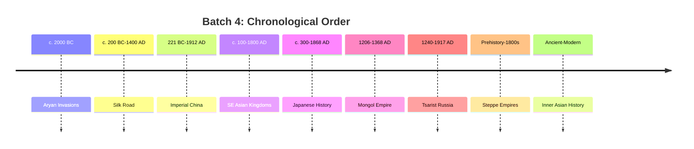

# MOC: Steppe Empires, Mongols & Asian Kingdoms

> **Batch 4 of History102** — 9 videos covering the civilizations of the Eurasian steppe, Inner Asia, and the kingdoms of East and Southeast Asia.

## The Eurasian Steppe & Inner Asia

| Note | Video Link | Duration | Core Topic |
|------|-----------|----------|------------|
| [[Aryan Invasions]] | [Watch](https://www.youtube.com/watch?v=R-yMhzWlUtw) | 54 min | Indo-European migrations from the Pontic-Caspian steppe across Eurasia (c. 2000 BC) |
| [[Steppe Empires]] | [Watch](https://www.youtube.com/watch?v=QwvGQV2eb40) | 2h 5min | Comprehensive history of steppe nomads as "anti-civilization" |
| [[Inner Asian History]] | [Watch](https://www.youtube.com/watch?v=eNd-t1lJGfw) | 2h 9min | Central Asia, Afghanistan, Xinjiang, Tibet — the hinge of Eurasia |
| [[Mongol Empire]] | [Watch](https://www.youtube.com/watch?v=O0EZOtrqE5I) | 2h 13min | Genghis Khan and the largest contiguous land empire in history |

## Trade & Eastern Kingdoms

| Note | Video Link | Duration | Core Topic |
|------|-----------|----------|------------|
| [[Silk Road]] | [Watch](https://www.youtube.com/watch?v=JNHjGVYfXjg) | 1h 19min | The network of trade routes that connected Eurasia for 1,500 years |
| [[South-East Asian Kingdoms]] | [Watch](https://www.youtube.com/watch?v=6AEn4Gl_ZpM) | 1h 24min | Khmer, Srivijaya, Pagan, Ayutthaya — Indianized kingdoms of SE Asia |
| [[Imperial China]] | [Watch](https://www.youtube.com/watch?v=TYWTfoBSoIk) | 2h 21min | 2,000 years of Chinese imperial history from Qin to Qing |
| [[Japanese History]] | [Watch](https://www.youtube.com/watch?v=dMEm8KAuD3c) | 2h 41min | From Yamato to Meiji — Japan's unique island civilization |
| [[Tzarist Russia]] | [Watch](https://www.youtube.com/watch?v=3ZX4rye0JBg) | 56 min | The Tsarist state from Mongol rule to the 1917 Revolution |

## Thematic Connections

### Steppe-Sedentary Polarity
The central theme of this batch: the Eurasian steppe functioned as an "anti-civilization" in polarity with the great sedentary civilizations. Each of the four great civilizations (Europe, Middle East, India, China) was shaped by its interaction with the steppe.

### The Mongol Cataclysm
The Mongol Empire (c. 1200–1368) appears across almost every video as a transformative event. It:
- Destroyed Central Asia's irrigation and urban infrastructure permanently
- Killed ~80 million people (10% of world population)
- Created the Pax Mongolica that enabled the Silk Road's golden age
- Shaped Russia's political DNA (Golden Horde)
- Established the Yuan Dynasty in China
- Both climaxed and exhausted steppe power

### The Steppe Legacy
Key contributions of steppe peoples to world history:
- Horse domestication and cavalry warfare
- The chariot (decisive military technology of the Bronze Age)
- The composite bow
- Transmission of goods, ideas, and religions along the Silk Road
- Political models (Mongol-influenced autocracy in Russia, Timurid-influenced rule in India)

### Civilizational Boundaries
Inner Asia functioned as the hinge where China, India, Persia, and Europe met — both as a crossroads and a barrier. The mountains and deserts of Central Asia created natural civilizational boundaries that shaped the distinct identities of each great civilization.

## Chronological Flow

## Channel Info

**Channel:** [History102](https://www.youtube.com/@History102-qg5oj) with Rudyard Lynch (WhatifAltHist) & Austin Padgett
**Vault:** See also Batch 3 ([[_MOC_Medieval_Migration]]) and Batch 5 ([[_MOC_Early_Modern]])
